# Analysis for School District Analysis

## Overview
The purpose of this analysis was for the school board to take a look at students standardized test scores and funding for a district. The initial analysis completed was done using a file that after the fact showed evidence of academic dishonesty.  In order to uphold state-testing standards, a secondary analysis was done. For the secondary analysis, our point of contact - Maria, requested that we replace the math and reading scores for Thomas High School (THS) ninth graders with NaNs while maintaining the rest of the data. Once the data was replaced, we continued with our analysis and noted the impact of the replacements.

## Results
* **How is the district summary affected?**

District Summary was not as affected by the removal of THS' subject test scores as one would think. The overall effect of test score replacement was 0.1% in the overall passing student percentage.

The following are the tables showing the district summaries analysis. The first photo below is from the initial analysis, here we can see how including THS' subject test scores resulted in the overall passing percentage to be 65%. 

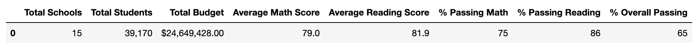

The photo below shows the district summary analysis revisied, meaning it is no longer considering THS' subject test scores in the analysis because those values are now NaN.

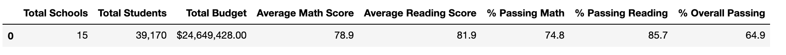

* **How is the school summary affected?**

THS' school summary was affected by the replacement of the subject test scores by having the school's passing rate decreae significantly. In the original analysis, first figure below, the overall passing percentage for the school was 90%. The original analysis did contain all grade levels with the dishonest test scores. In the second analysis, the grades for all analysis relevant to THS was limited to tenth to twelfth grade since the ninth graders scores were set to NaN. This change in scope for grade levels and more accurate data provided us with an accurate analysis for THS and the scores and passing percentages. In summary, THS' school summary was affected by a decrease in all passing percentages by roughly 30%.

This first figure shows THS' summary from grades nine to twelve, or our original analysis.

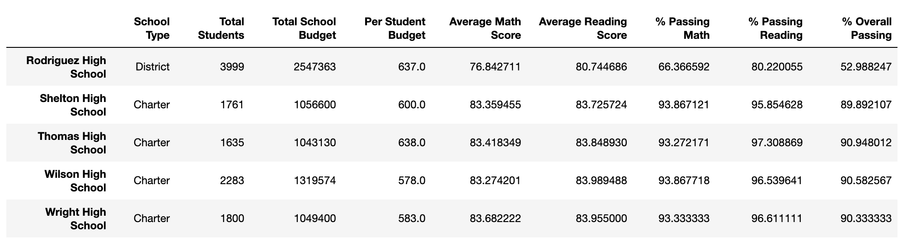

This second figure shows THS' summary from grades ten to twelve, also known as our secondary analysis.

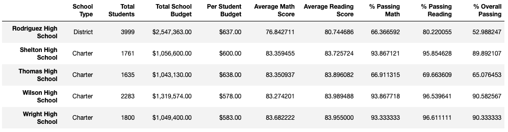

* **How does replacing the ninth graders’ math and reading scores affect Thomas High School’s performance relative to the other schools?**

Replacing the ninth graders' scores in relation to the other schools did not affect THS's performance. In each analysis we did, both with the ninth graders scores and without, THS ranked high against other schools. Upon first look, the thought would be the rankings would be different, but in our second analysis the calculations for THS were done against THS tenth to twelfth grade population, rather than each individuals student count. This means that every other school count was for four grades, when THS' school count was for three grades - because of this difference in school counts, the difference between rankings in the first and second analysis will not be as different as one might think.

* **How does replacing the ninth-grade scores affect the following:**
  * **Math and reading scores by grade**
  
 Math Scores:
 
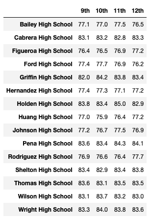 

Reading Scores: 

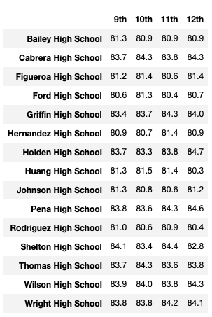
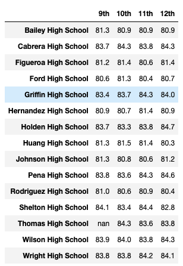

  * **Scores by school spending**

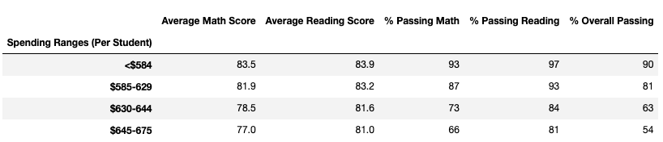
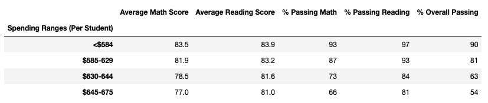

  * **Scores by school size**

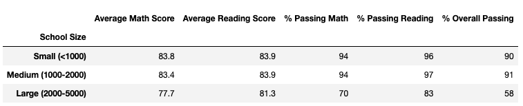

  * **Scores by school types**

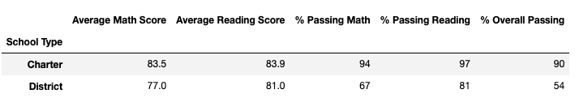
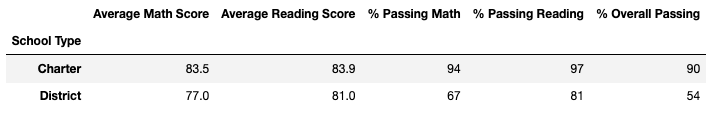

## Summary

Overall, there are four changes in the second school district analysis that can be made after replacing the ninth grade reading and math scores at Thomas High School with NaNs:
1. The overall passing percentage rate for the school dropped from 91% to 65%.
2. The average scores for math and reading fell as well, not as significantly as the overall passing percentage, but the results did fall an amount. 
3. Grade level data for ninth graders at THS will show as NaN, which can be later updated once the students honest results come in.
4. In further analysis (i.e. school spending, size, and types), the removal of the test scores did not impact the results. Majority of the differences were less than one percent in these categories.

